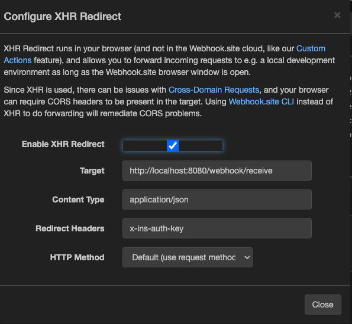
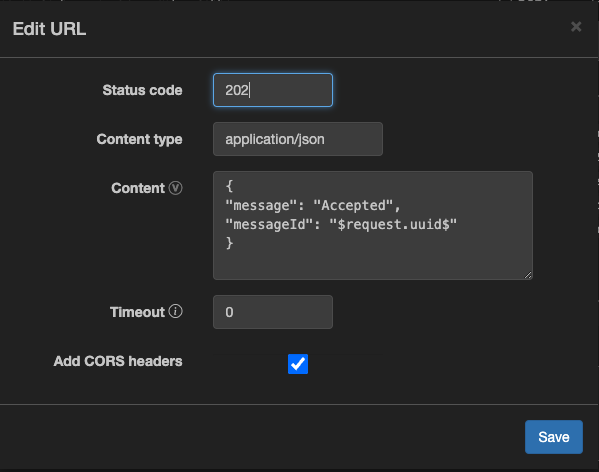

# MessageWave: Automated Messaging System

## Project Description
MessageWave is an automated messaging system designed to streamline the process of 
sending scheduled messages based on specific criteria and intervals. 
The system retrieves unsent messages from a PostgreSQL database, dispatches 
them at predetermined intervals, and uses Redis to cache delivery statuses. 
It's built to support scalable operations and ensure reliable message delivery 
through RabbitMQ.

## Features
- **Automated Messaging:** Send messages automatically every 2 minutes or at configured intervals.
- **Message Queueing:** Utilize RabbitMQ to manage message queuing and ensure reliable processing and delivery.
- **Caching Mechanism:** Use Redis to cache message delivery statuses, enhancing performance and reliability.
- **API Control:** Start and stop message sending processes through RESTful API endpoints.
- **Message Tracking:** Track and retrieve a list of sent messages through a dedicated endpoint.
- **Scalability and Resilience:** Designed for scalability and resilience with Docker containerization.

## Used Technologies
- **Spring Boot:** For creating the application framework and RESTful services.
- **PostgreSQL:** Used as the primary database to store message data.
- **RabbitMQ:** For queuing messages and ensuring reliable delivery.
- **Redis:** For caching message delivery statuses to enhance performance.
- **Docker:** For containerizing the application and dependencies, ensuring consistency across environments.

## Architecture Overview
The system architecture consists of three main components:
1. **Application Core:** The Spring Boot application handles all business logic, including interaction with the database, queuing messages via RabbitMQ, and caching with Redis.
2. **Message Queue:** RabbitMQ is used to decouple the message sending process from message retrieval, adding a layer of reliability and scalability.
3. **Cache Layer:** Redis is used to quickly access the status of message deliveries, reducing the load on the primary database and improving response times.

## Application Startup
Running the application is a straightforward process. Execute the following commands in order:
```
docker-compose build
docker-compose up -d
```
You can observe your services with the following command:
```
docker ps
```

## Accessing Management Panels
Access management panels for PostgreSQL, RabbitMQ, and Redis as follows:
- **PostgreSQL:** While PostgreSQL does not have a native management panel, you can connect to the database using a SQL client such as PgAdmin or DBeaver.
- **RabbitMQ:** Accessible at http://localhost:15672. Default username and password are guest / guest.
- **Redis:** Redis does not have a management panel, but you can check the connection using the Redis CLI.

## API Documentation
Please see http://localhost:8080/swagger-ui/index.html

## Configuration
To set up and run the MessageWave application, configure the application.properties file with your parameters.
### Explanation of Properties
- **Spring Data Source:** Configuration settings for connecting to the PostgreSQL database. Ensure the database is created and accessible.
- **JPA Settings:** Configures Hibernate to update the schema at startup and initializes data sources after JPA.
- **RabbitMQ Settings:** Specifies the connection settings for RabbitMQ, which is essential for queuing messages.
- **Redis Settings:** Defines the connection settings for Redis, used for caching data such as sent messages.
- Application Specific Properties
  - **messagewave.rabbitmq.queue.name:** The name of the RabbitMQ queue for storing messages.
  - **messagewave.redis.key.sentMessagePrefix:** Prefix for keys stored in Redis, used to track sent messages.
  - **messagewave.message.sender.webhook.url:** The URL of the webhook where messages will be sent.
  - **messagewave.message.sender.auth.key:** Authentication key for securing message transmissions to the webhook.
## Important Notes
- Adjust the database URL and credentials according to your environment.
- Ensure RabbitMQ and Redis are running and accessible via the specified ports.
- Validate the webhook URL and authentication key to ensure messages are sent successfully.

### Webhook.site Configuration
- This application uses webhook.site for the incoming requests. Please apply the following settings to your endpoint:



